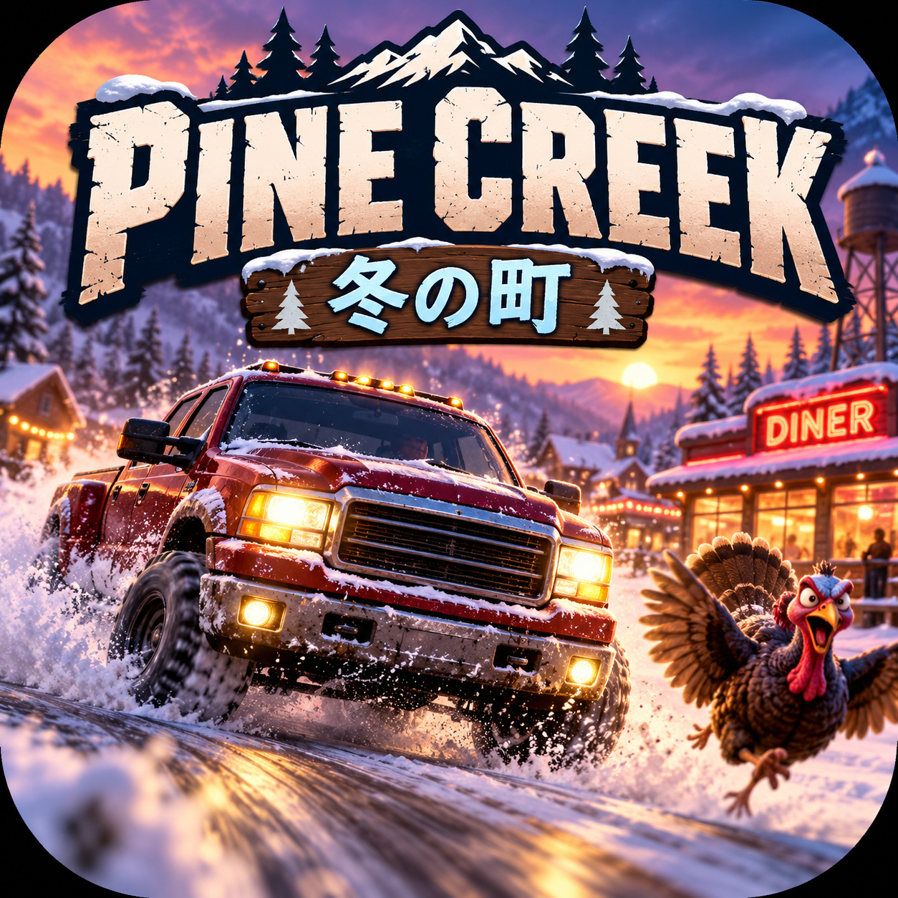

# Pine Creek: 冬の町



雪に埋もれた架空の田舎町 **Pine Creek** を、古い架空のピックアップで走り回るAndroid向け3Dドライブゲームです。

> 人口は少ない。トラックは多い。常識は春まで雪の下。

巨大BBQ、埋まった除雪車、増殖する中古ピックアップ、役場を占拠する七面鳥ケビン、雪だるま市議会など、「住民だけは普通だと思っている変な日常」をゲームにしています。

## 現在の開発版

**v0.7.0-alpha1 — Godot新物理版**

従来のJava + 自前OpenGL版から、Godot 4.7.2へ移行中です。旧実装は比較・検証用として `app/` に残していますが、今後の主開発は `godot/` です。

### v0.7.0-alpha1で変わったところ

- Godot 4.7.2 + `RigidBody3D` へ移行
- 4輪RayCastサスペンション
- 後輪駆動、前輪操舵
- **前進/バックはカメラではなく車体方向が基準**
- デジタル左右入力をステアリングラックで平滑化し、押した瞬間のフルロックを防止
- 高速ほど最大舵角とステア速度を抑える
- 車体が先に旋回し、カメラが遅れて追従
- Androidのpointer IDごとに操作を保持するマルチタッチ
- アクセル + 左右ステアリングの同時押し
- 大型タッチボタン、押下フィードバック、判定領域拡大
- 車両のBlenderソース + GLBモデル
- 建物・木・街灯・駐車車両に衝突判定
- 雪道の轍、街灯、建物の窓/ドア/積雪屋根
- 七面鳥ケビン、雪だるま市議会などの3D小物
- 提供された1254×1254キーアートを**解像度を変えず高品質JPEG(Q95 / 4:4:4)**へ変換してタイトル素材へ使用
- 8本の町内エピソード + 周回後のランダム事件モード

## 遊ぶだけなら

GitHubの **Releases** から `PineCreek-Godot-v0.7.0-alpha1.apk` を取得してAndroidへインストールしてください。

このα版は旧Java版と共存できるよう、package IDを `com.pinecreek.game.godot` に分けています。

## 操作

| 操作 | 内容 |
|---|---|
| ◀ / ▶ | ハンドル |
| アクセル | 前進 |
| バック | 後退 |
| ブレーキ | 減速・停止 |
| 警笛 | クラクション / 一部イベント |
| アクション | 目的地でストーリー進行 |
| 復帰 | 最後に安定していた場所へ戻る |
| 画面ドラッグ | カメラを一時的に見回す |

デスクトップQAでは WASD / 矢印、Space、H、E、R も使用できます。

## ストーリー

Godot版では以下を実装済みです。

- BBQ小盛り非常事態
- 町長と除雪車
- ジムの18台目
- 役場のケビン
- 郵便受けの冬季移住
- 春の誤報
- 公共交通が発生
- 雪だるま市議会

一周後は町内事件がランダムに再発します。追加案は [docs/STORIES.md](docs/STORIES.md) にあります。

## 開発・ビルド

GitHub Actionsは必須ではありません。現在のGodot版は **Zorin OS / Linux上でローカルビルドして、そのAPKをReleaseへ公開する方式**を主にしています。

必要環境と手順は [docs/BUILD.md](docs/BUILD.md) を参照してください。

最短:

```bash
cd godot
./tools/qa_native.sh
./tools/build_android.sh
```

`qa_native.sh` は回帰テストと実描画スクリーンショットQAを実行します。  
`build_android.sh` はテスト → release APK生成 → 署名検証 → package/version/SDK検証 → SHA-256生成まで行います。

## オープンソースについて

かなり勢いで作り始めた、意図的に狂った小規模ゲームです。遊べる状態を目指していますが、**α版なのでバグはあります**。

fork、改変、魔改造、別ストーリー追加、モデル差し替えなどご自由にどうぞ。Issue / Pull Requestも歓迎です。

コードと、このリポジトリ内でPine Creek用に作成した素材は、特記がない限り **MIT License** です。実在メーカーのロゴや車名はゲームへ持ち込まない方針です。

## ディレクトリ

```text
godot/                     現行Godot版
  assets/vehicles/         ゲーム用GLB
  assets/ui/               タイトル/ランチャー画像
  scenes/                  Godot scene
  scripts/                 車両/カメラ/UI/ストーリー
  tests/                   自動・実描画QA
  tools/                   ローカルQA/Android build
art-source/vehicles/       Blender編集用ソース
app/                       旧Java + 自前OpenGL版
docs/                      開発・ストーリー・リリース資料
```

## ライセンス

[MIT License](LICENSE)
