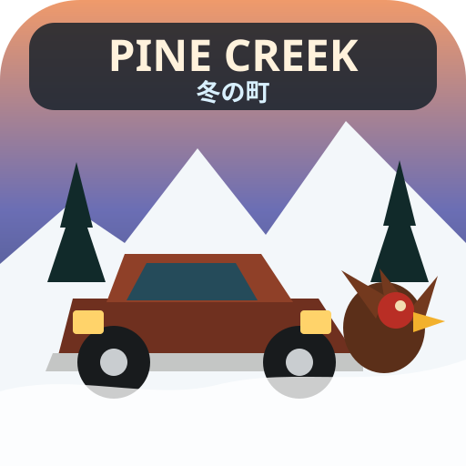

# Pine Creek: 冬の町



雪に埋もれた架空の田舎町 **Pine Creek** を、古い架空のピックアップで走り回るAndroid向け3Dドライブゲームです。

町の基本思想は単純です。

> 人口は少ない。トラックは多い。常識は春まで雪の下。

巨大BBQ、雪に埋まった除雪車、バッテリー上がり、「走れば車だ」中古車店、増殖するジムのトラック、役場を占拠する七面鳥ケビンなど、**普通の日常が少しずつおかしい田舎町**をテーマにしています。

## 現在のバージョン

**v0.5.0**

### ゲーム

- OpenGL ES 2.0による軽量3D描画
- 追従型3Dカメラ
- 前進 / ブレーキ / **バック走行**
- ホイールベースと操舵角を使った車両旋回
- 前進と後退で自然に反転するステアリング挙動
- 高速時に穏やかになるステアリング
- 圧雪路と深雪で異なる加速・抵抗・グリップ
- より細かい自作ピックアップモデル
  - ボンネット
  - キャビン
  - 荷台
  - グリル
  - バンパー
  - ミラー
  - 窓
  - 灯火
  - 円柱タイヤ
  - 操舵する前輪
- 燃料
- 牽引
- 雪
- 街灯
- 住民
- ランダム町内放送 / 無線イベント
- 端末上でリアルタイム生成するBGM・風・エンジン・警笛・効果音
- セーブ / 続きから
- 自由走行

## ストーリー

タイトル画面から複数の話を選べます。

1. **初めての冬**  
   巨大BBQの配達から始まり、町長と除雪車、バッテリー救援、ボブ中古車店、ジムの17台目、七面鳥ケビン、雪嵐の緊急便を経験して町民認定を目指します。

2. **18台目のトラック**  
   ジムの庭から勝手に旅立った18台目を探します。発見して牽引しても話は終わりません。

3. **ケビンの大脱走**  
   七面鳥ケビンがパンを持って逃走。食堂、給油所、中古車店、町役場を巻き込みます。

4. **停電の夜**  
   町全体の停電。原因候補は大量のブロックヒーター。発電機を牽引しながら町中の救援を行います。

さらにプレイ中にはランダムな町内放送や住民無線が入り、毎回少し違うPine Creekの日常が発生します。

詳しいストーリー案は [docs/STORIES.md](docs/STORIES.md) にあります。

## 操作

| 操作 | 内容 |
|---|---|
| ◀ / ▶ | ハンドル |
| アクセル | 前進 |
| バック | 後退 |
| ブレーキ | 減速・停止 |
| 警笛 | クラクション。イベントにも使用 |
| アクション | 目的地で会話・荷物・牽引などを進行 |

バック時は車速が負になるため、同じハンドル操作でも車体の旋回方向が自然に反転します。

## APKを入手する

GitHubの **Actions** → **Build Pine Creek APK** → 成功した実行 → **Artifacts** からAPKを含むZIPを取得できます。

## ビルド

Android StudioなしでもGitHub Actionsでビルドできます。

詳しくは [docs/BUILD.md](docs/BUILD.md) を参照してください。

最小構成:

- JDK 17
- Android SDK 35
- Android Build Tools 35.0.0
- Gradle 8.11.1
- Android Gradle Plugin 8.9.2

ローカルで環境が揃っている場合:

```bash
gradle :app:assembleDebug
```

生成物:

```text
app/build/outputs/apk/debug/app-debug.apk
```

## リリース手順

[docs/RELEASE.md](docs/RELEASE.md) に、バージョン更新からGitHub ActionsでのAPK確認までをまとめています。

## 開発方針

このプロジェクトは意図的に大規模ゲームエンジンを使わず、Android標準API + OpenGL ESで構成しています。

- 外部ゲームエンジン不要
- 外部3D素材不要
- 外部音源不要
- BGM / エンジン / 風 / 効果音はコードからPCMを生成
- 3Dモデルはプリミティブメッシュを組み合わせた自作モデル

構成は [docs/ARCHITECTURE.md](docs/ARCHITECTURE.md) を参照してください。

## コントリビューション

バグ修正、新しい町内放送、ストーリー、建物、車両モデル改善など歓迎です。

最初に [CONTRIBUTING.md](CONTRIBUTING.md) を読んでください。

Issueには以下があると助かります。

- Android端末名
- Androidバージョン
- 再現手順
- スクリーンショット
- 発生したストーリー / ミッション
- GitHub Actionsの場合は失敗したstepとログ

## アイコン

現在のアイコンは、雪のPine Creek・赤いピックアップ・食堂・七面鳥ケビンという生成コンセプトを元に、Androidで扱いやすいオリジナルのベクターアイコンへ落とし込んでいます。

SVG版: [docs/app-icon.svg](docs/app-icon.svg)

## アセットについて

ゲーム内の車両・町・人物は架空です。特定メーカーのロゴや実車名は使用していません。

## ライセンス

コードおよびリポジトリ内で配布するプロジェクト素材は、特記がない限り **MIT License** です。

[LICENSE](LICENSE)
